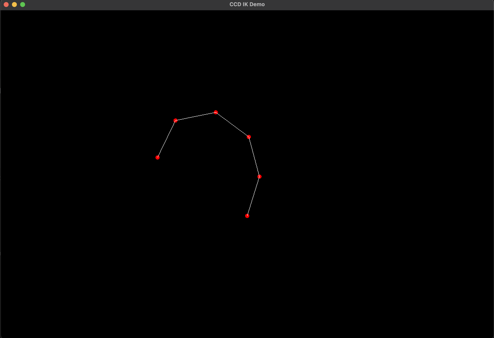

# Computer Graphics Basic Assignment (A-01)

## How to Build

### Requirements

- SFML Library https://www.sfml-dev.org/

### Procedure

To build:

```bash
A-01 % make
```

To run, after build:

```bash
A-01 % make run
```

Confirmation of all the operations are done in the following environment:

- CPU: Apple M3 Pro
- OS: macOS Sonoma 14.4
- C++ compiler: Apple clang 15.0.0


## Usage

- There are 6 joints on the screen by default. The number of joints and their initial positions are fixed, though you can change them by just editing the following part:
```cpp
    // initialization of window
    sf::RenderWindow window(sf::VideoMode(1200, 800), "CCD IK Demo");

    // initialization of skeleton
    Skeleton skeleton;
    sf::Vector2f basePosition(600, 500);
    int jointSpacing = 100;

    for (int i = 0; i < 6; ++i) {
        sf::Vector2f jointPos =
          basePosition + sf::Vector2f(jointSpacing * i, 0);
        skeleton.addJoint("Joint" + to_string(i + 1), jointPos);
    }
```
- To specify the target position, click and drag inside the screen.

## Demo

Available in `assets/demo.mov` .



## Implementation

- Implemented in C++ from scratch (huge thanks to https://mukai-lab.org/content/CcdParticleInverseKinematics.pdf).