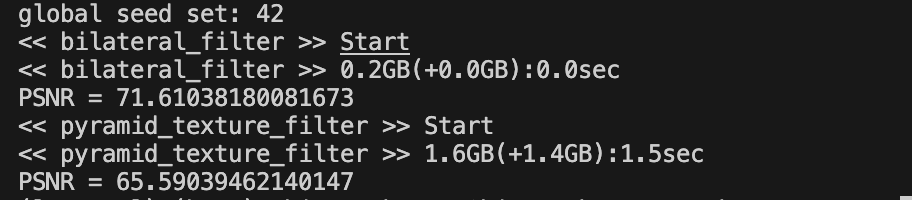
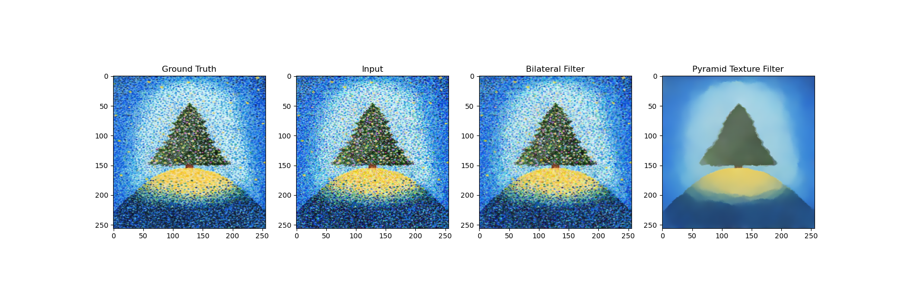
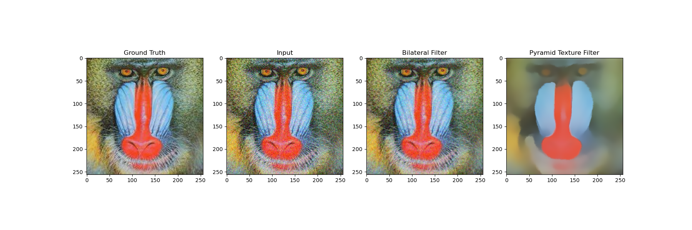

# Computer Graphics Basic Assignment (L-01)

## Requirements

- Python 3.10
- Dependencies:
```
pip install -r requirements.txt
```

## Usage

1. Set the filter you want to use in `denoise.py`:
    ```python
    bilateral_result = eval(noise_image, true_image, bilateral_filter)
    ```
    See `denoise.py` for the examples for the other filters.
2. Execute:
   ```bash
   python3 denoiser.py <image file>
   ```
3. You will get the output image and some statistics in the shell:
   
   

## Implementation & Experiments

### Implementation Details

I implemented the following filters (function names in `denoiser.py` shown in parentheses):

- Bilateral filter (`bilateral_filter`)
- Joint bilateral filter (`joint_bilateral_filter`)
- Pyramid texture filter (`pyramid_texture_filter`)
- Guided filter (`guided_filter`)
- Deep image prior (`deep_image_prior`)

All of these filters are written without using image processing libraries like OpenCV and Pillow. Except for `pyramid_texture_filter` (SciPy is used for linear interpolation) and `deep_image_prior` (PyTorch is used for the backbone CNNs), the algorithm is written in pure numpy.

Hyperparameters for pyramid texture filter and deep image prior are defined according to the corresponding papers ([Deep Image Prior](https://sites.skoltech.ru/app/data/uploads/sites/25/2018/04/deep_image_prior.pdf) and [Pyramid Texture Filtering](https://arxiv.org/abs/2305.06525)).

### Experiments

An input image are fed into a filter after added gaussian noise over the image. Below are the comparison of bilateral filter with pyramid texture filter. See `assets/outputs` for the results on the other filters.




