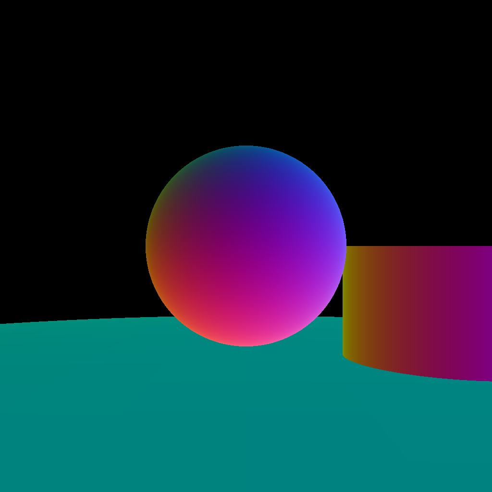

# Computer Graphics Basic Assignment (R-01)

## How to Build

### Requirements

- cmake >= 3.10
- OpenCV 4 (installation location written in `CMakeLists.txt` needs to be modified)

### Procedure

to build:

```Bash
R-01 % cd build
R-01 % cmake ..
R-01 % make
```

to run:

```Bash
R-01 % cd build
R-01 % ./main
```

Confirmation of all the operations are done in the following environment:

- CPU: Apple M3 Pro
- OS: macOS Sonoma 14.4
- C++ Compiler: g++ (Homebrew GCC 14.1.0) 14.1.0
- cmake: 3.29.6
- Libraries: OpenCV 4.9.0_9

## Usage and Implementation

Currently supports two types of shapes:
- cylinders around any vector perpendicular to the XY plane, and
- spheres.

Cylinders are initialized by passing 1. center of the bottom plane, 2. radius, and 3. height:

```C++
CylinderZ cylinder(cv::Vec3f(2, 5, 0), 1.0, 2);
```

Spheres are initialized by passing 1. center and 2. radius:
```C++
Sphere sphere(cv::Vec3f(0, 5, 0), 1.0);
```

Shading is implemented as just showing the color corresponding to the unit normal vector:
```C++
for (int i = 0; i < 3; ++i)
    color[i] = (rec.normal[i] + 1) / 2;  // rec.normal[i] is in (-1, 1)
```

The sample output:


## References

- [Phisically Based Rendering](https://www.pbr-book.org/3ed-2018/contents)
- [Ray Tracing in One Weekend](https://raytracing.github.io/books/RayTracingInOneWeekend.html)